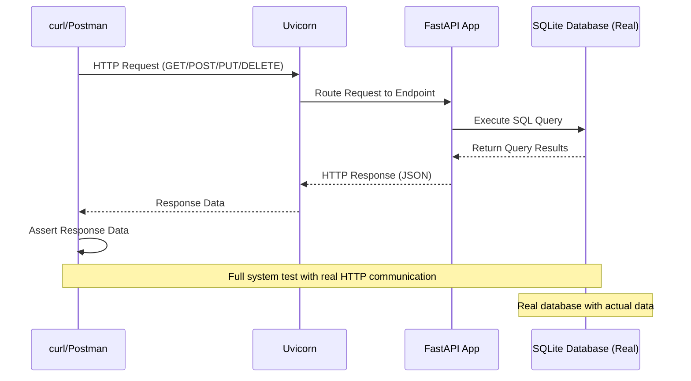
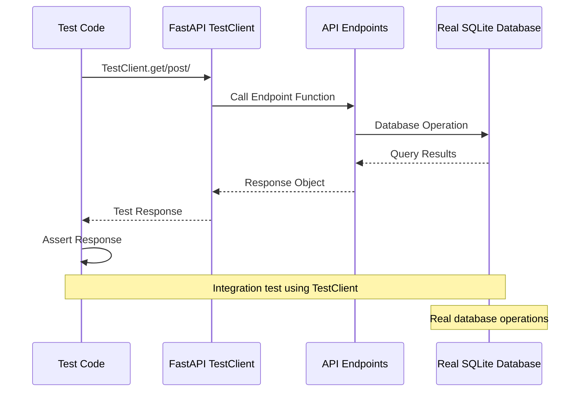
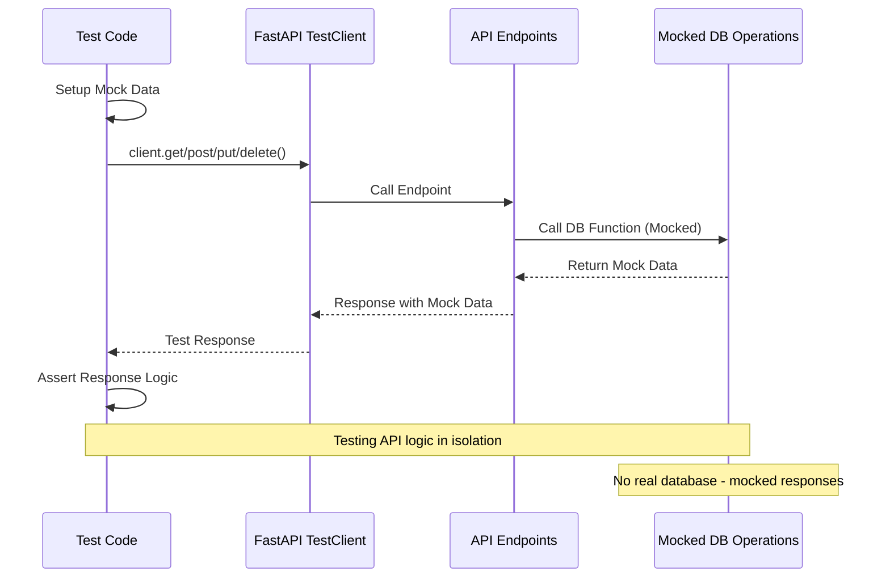
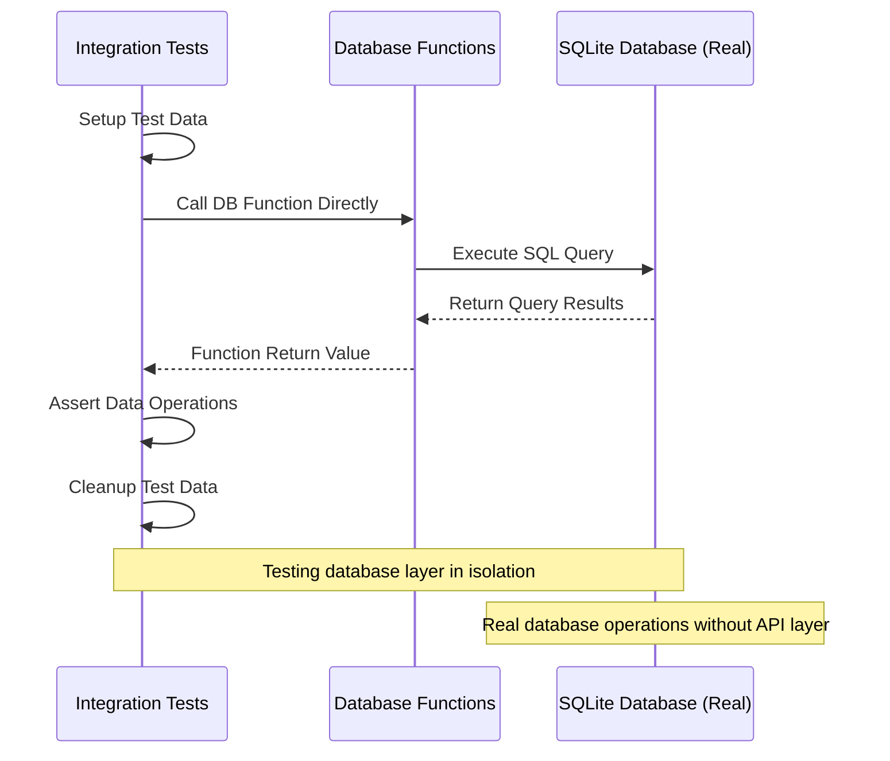

# Test design strategies

As a reminder, **test design** is the process of choosing the strategy and approach for testing our app.

#### End-to-end (manual) testing

In the previous project, you tested your endpoints **manually** using `curl` or Postman, while the app was running locally in the background.
This strategy is known as **end-to-end testing**, because you, as a tester, interact with the app just like a real user would do. And the app is fully running, as a whole, with all its components (database, external OCI service communication, etc...).

Let's explore another common strategy:

#### Integration test 

In this approach we test the API endpoint, while interacting with a real database. 
This is why it's called an **integration test** - we test the integration between the API layer and the database layer.

Note that we **don't** run a real app server (like Uvicorn) in this approach, alternatively, we use FastAPI's `TestClient` to simulate HTTP requests to the API endpoints. 
We also **mock the OCI Document AI service calls**, so we don't depend on external services during the test.

### API Unit testing + DB integration testing

This approach is divided into two parts:

#### Part I: Unit test - API endpoints only

We test the API endpoints in isolation using FastAPI's `TestClient`,
while mocking the database operations.

#### Part I: DB Integration test

We test the database functions directly without going through the API layer.
This allows more flexibility in testing the database operations, as we don't need to pass through an API endpoint.

